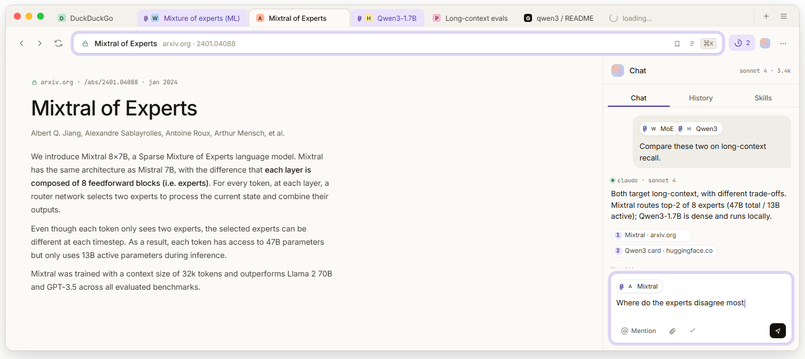
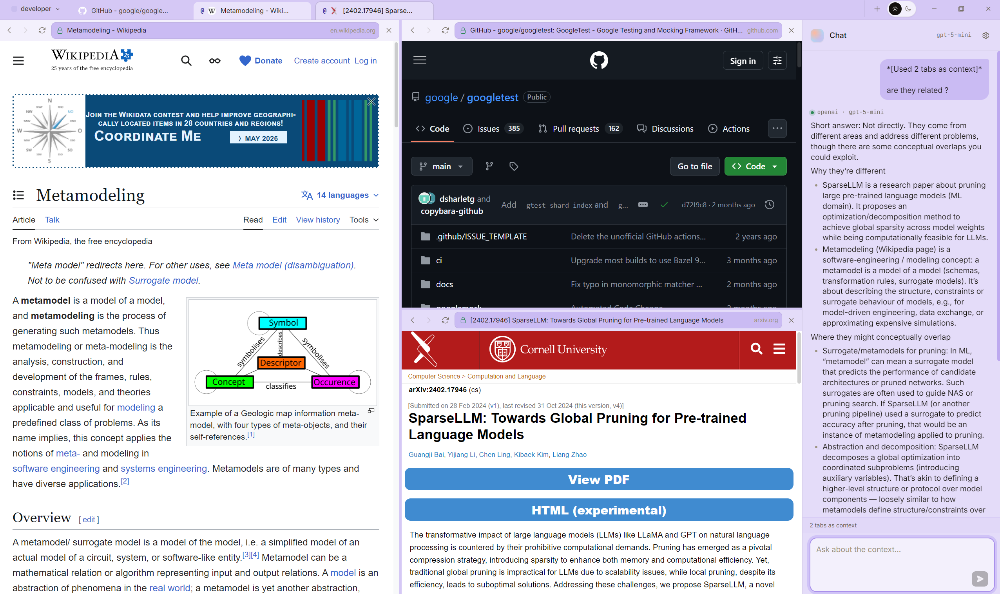
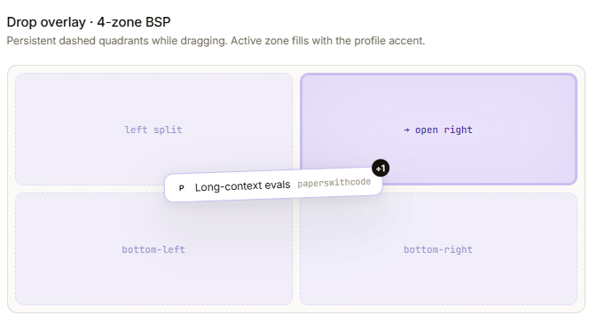
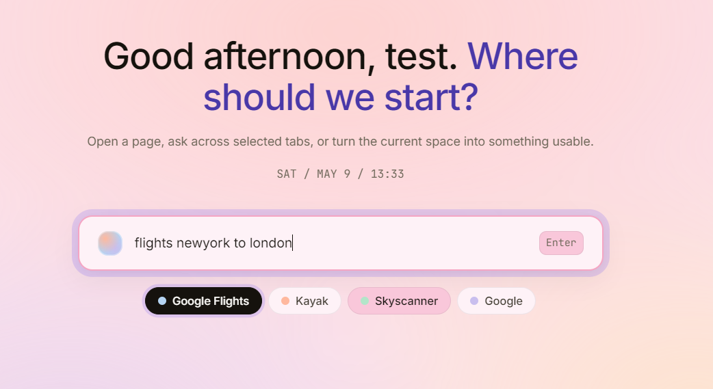
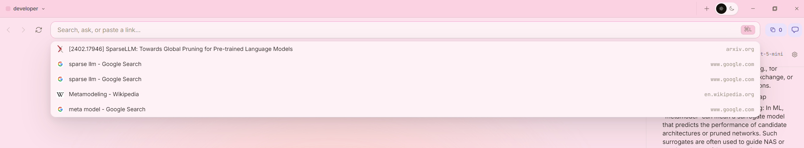
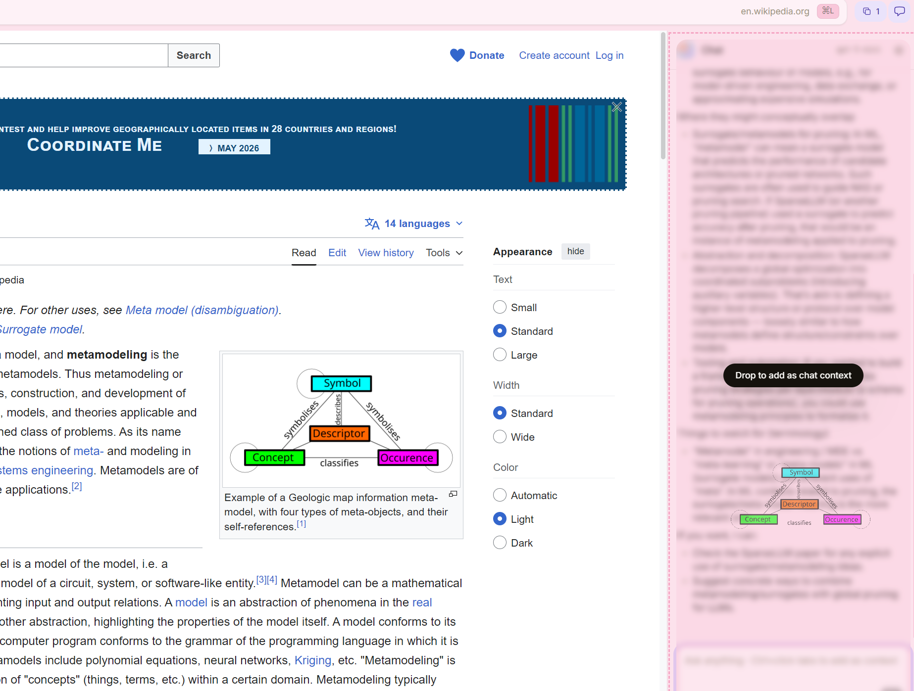
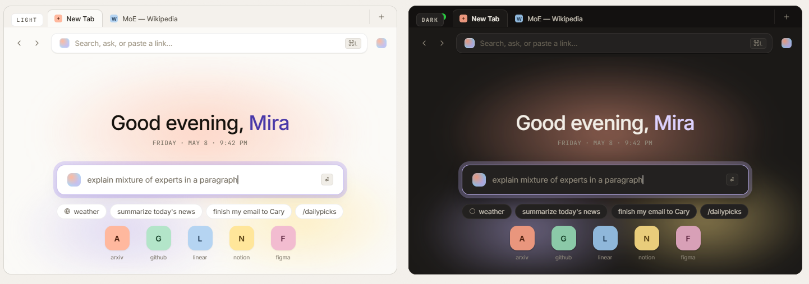

<div align="center">


# Sable

**A browser where chat and pages are one workspace.**

<p>
  
  
  
  
  
  
  
</p>

</div>

---

Sable turns your browser into one workspace where chat and pages can finally talk to each other.

Drop a paragraph from any page into the chat sidebar — Sable cites it back automatically. Drop an image from a webpage into chat — it goes in as a prompt the AI can actually see. Ctrl-click a few tabs and they become one shared context for whatever you ask next. Drag tabs together to group them; drag them to an edge to split your view side-by-side or stacked, as deep as you want.

**Free out of the box — no API key, no subscription, no per-message cost.** A fast AI model is built in and runs entirely on your machine. Want frontier-quality answers for harder work? Paste your **Anthropic** or **OpenAI** key and Sable streams from those instead — pay your provider directly, switch any time. Everything renders as proper markdown.

It's not a Chrome wrapper with a chat button. It's a real browser, designed from scratch around the way you actually work with AI — and built to grow into **recordable workflow "skills", a memory of your browsing, and a personal knowledge graph** that makes everything you've ever read searchable.

Available on **Windows, macOS, Linux**.

<div align="center">
  <br />
  
  <p><sub><em>Three panes, one chat sidebar, all driven by your AI of choice.</em></sub></p>
</div>

---

## Table of contents

- [Highlights](#highlights)
- [What you can do today](#what-you-can-do-today)
- [In practice — example workflows](#in-practice--example-workflows)
- [Personalities — per-space themes](#personalities--per-space-themes)
- [Quickstart](#quickstart)
- [Architecture](#architecture)
- [Tech stack](#tech-stack)
- [Roadmap](#roadmap)
- [Repo layout](#repo-layout)
- [Privacy posture](#privacy-posture)
- [Built on](#built-on)
- [Contributing & license](#contributing--license)

---

## Highlights

|                                               |                                                                                                                         |
| --------------------------------------------- | ----------------------------------------------------------------------------------------------------------------------- |
| **A real browser**                            | Native-feeling window with the snap controls / traffic lights you already know — not a webview-in-a-window              |
| **Split panes, any depth**                    | Drag a tab to a pane edge to split your view. Splits nest as deep as you want; dividers drag-resize                     |
| **Tab groups**                                | Drag one tab onto another to group them — they line up side-by-side automatically                                       |
| **A chat sidebar that reads what you browse** | Drop text → cited as markdown. Drop an image → the AI sees it. Ctrl-click tabs → they become one shared context         |
| **Smart new-tab page**                        | Type what you want and hit Enter — Sable picks the right destination even if you didn't type a URL                      |
| **Autocomplete from your history**            | Type a few letters; Sable suggests the page you actually meant, ranked by how often you go there                        |
| **Customizable bookmarks**                    | Pin and reorder the sites you actually use, right on the new-tab page                                                   |
| **Markdown chat**                             | Replies render the way you'd want — code blocks, lists, tables, links, all live                                         |
| **No API key required**                       | A fast AI model is built in. Free, on-device, no subscription, works offline                                            |
| **BYOK if you want frontier quality**         | Paste an Anthropic or OpenAI key and Sable streams from those instead. Pay your provider directly. Switch any time      |
| **Themed workspaces**                         | Each "space" gets its own colour personality — lavender, mint, coral, amber, rose, sky, sage — light & dark inside each |
| **First-launch setup**                        | Splash → tell Sable your name → pick a model. Skippable, and re-runnable with one env var                               |
| **Keys stay safe**                            | API keys live in your OS's password store, never on disk in plain text, never visible to the page                       |
| **Provably correct layout**                   | The pane / split / group logic is its own little library with 41 unit tests                                             |
| **CI on every PR**                            | Windows × macOS × Linux × {typecheck, tests, build} runs automatically                                                  |

---

## What you can do today


- **A horizontal tab strip** at the top of the window, per active space. Drag a tab onto a pane edge to split. Drag one tab onto another to group them — Sable auto-arranges them side-by-side.
- **Each pane gets its own little URL bar** in multi-pane mode, so you always know which pane you're typing into.
- **Pinned bookmarks** on the new-tab page — add, rename, reorder the sites you actually use.
- **Autocomplete in the URL bar** suggests the page you mean, based on what you visit and how often.
- **A new-tab page that resolves what you mean.** Type `yt some band` → YouTube. Type `flight sfo to nrt` → Google Flights. Type something less obvious — the on-device model takes a swing at it and falls back to a search if it's not sure.
- **Native-feeling window** — Windows snap layouts, Mac traffic lights, custom on Linux.
- **Shortcuts:** `Ctrl+T` new tab · `Ctrl+N` new window · `Ctrl+W` close tab · `Ctrl+L` focus URL bar · `Ctrl+R` reload · `Ctrl+.` toggle chat sidebar · `F12` DevTools.

<div align="center">
  <table>
    <tr>
      <td align="center"><br /><sub><em>Drag pill → pill = group + auto-split</em></sub></td>
      <td align="center"><br /><sub><em>5-zone drop overlay → arbitrary nested splits</em></sub></td>
    </tr>
    <tr>
      <td align="center"><br /><sub><em>Hybrid intent resolver on the new-tab page</em></sub></td>
      <td align="center"><br /><sub><em>History-powered autocomplete in the URL bar</em></sub></td>
    </tr>
  </table>
</div>

### Chat that *uses* what you're browsing

- **Drop anywhere in the chat sidebar.** Text becomes a citation (markdown blockquote with the source link). Images go straight in as something the AI can see.
- **Ctrl-click tabs** to mark them as context — they get a small badge in the strip. When you send a message, Sable pulls the main content out of each tab and packs as much as fits, telling you what didn't make it.
- **Replies render as markdown** with code blocks, tables, lists, and live links.
- **Resizable sidebar** — drag the left edge to give chat more or less room.
- Right-click any tab to quick-toggle its context state, move it to another space, or close it.

<div align="center">
  
  <p><sub><em>Drop a passage anywhere in the sidebar — Sable cites it back as a markdown blockquote with the source URL.</em></sub></p>
</div>

### AI is built in — bring your own key only if you want

Sable ships with **a free on-device AI model**. It works the moment you finish onboarding — no key to paste, no subscription, no API bill. For harder work where you want frontier-quality answers, paste an **Anthropic** or **OpenAI** key and Sable will stream from those instead. Pick the right tool per task; switch any time.

| Provider                               | What you do                                        | Cost                                |
| -------------------------------------- | -------------------------------------------------- | ----------------------------------- |
| **Built-in offline model** *(default)* | Click **Download** in Settings (~1.1 GB, one-time) | **Free** — runs on your machine     |
| **Anthropic**                          | Paste your `sk-ant-…` key in Settings              | Pay your Anthropic account directly |
| **OpenAI**                             | Paste your `sk-…` key in Settings                  | Pay your OpenAI account directly    |

The conversation, the citations, the dropped images — everything works the same way no matter which provider is active. Replies stream in real time. Sable never charges you anything; if you use Anthropic or OpenAI, you're billed by them on your own account.

### The built-in offline model

We bundle **Qwen 3** in three sizes — pick what fits your machine at onboarding (or change later in Settings):

| Variant                     | Size    | Good for                             |
| --------------------------- | ------- | ------------------------------------ |
| Qwen 3 0.6B                 | ~400 MB | Older laptops / very modest hardware |
| **Qwen 3 1.7B** *(default)* | ~1.1 GB | 8 GB RAM, no GPU                     |
| Qwen 3 4B Instruct          | ~2.5 GB | 16 GB RAM, higher quality            |

Why Qwen 3? It's released under a permissive open-source license (Apache 2.0) — no monthly-active-users cap, no attribution requirement, no kill switch. That's a rare combination among modern open-weight models, and it's what lets us ship one as the default. It runs fully on your machine, with no network needed after the download. GPU acceleration kicks in automatically if your hardware supports it.

---

## In practice — example workflows

Concrete recipes for the kind of work Sable was built for. Each one takes ~30 seconds of setup.

### 1. Compare three articles on the same news story

> *"What do these three sources actually disagree on?"*

1. Open three articles in three tabs.
2. Drag tab #2 onto tab #1 in the strip — they group and split side-by-side.
3. Drag tab #3 onto the right edge of pane #2 for a 3-way split.
4. **Ctrl-click all three tabs** to add them as chat context.
5. In the composer: *"Compare the framing across these three sources. Where do they agree? Where do they disagree? Quote the disagreements."*

The reply comes back with quoted excerpts from each article, organised by point of disagreement.

<div align="center">
  
</div>

### 2. Turn a leaderboard into a markdown table

> *"Give me this table as something I can paste into a doc."*

1. Navigate to the page with the table.
2. **Drop the image** (or a screenshot region) into the chat sidebar.
3. *"Convert this leaderboard into a markdown table. Columns: rank, team, score, change."*

The reply comes back as a real markdown table you can copy straight into your notes.

### 3. Trip planning in one space

> *"Plan a long weekend in Tokyo from May 30."*

1. Make a new space called **Tokyo** and give it the **Sky** theme.
2. On the new-tab page, type `flights sfo to nrt may 30` → Google Flights opens with the right query.
3. Open weather, hotels, neighborhood guides as additional tabs.
4. Drag the four most relevant tabs together to group them.
5. Ctrl-click the group and ask chat: *"Build a 4-day itinerary across these tabs. Include rough budget and one rest evening."*

Switch back to your **Personal** space and Tokyo is still parked there, sky-blue and laid out exactly as you left it.

### 4. Code review in a split pane

> *"Read the diff and the docs side-by-side."*

1. Open the GitHub PR with the diff in the left pane.
2. Drag the docs tab onto the right edge of the layout to split vertically.
3. Each pane now has its own little URL bar — you can navigate independently.
4. Ctrl-click both tabs and ask chat: *"Does this change match the documented behaviour on the right? Any inconsistencies?"*

### 5. Research drawer — drop passages, ask for synthesis

> *"Pull together what I've been highlighting across five sources."*

1. Open five long-form sources in a **Research** space, one per tab.
2. As you read, **drag interesting paragraphs straight into the chat sidebar** — each becomes a citation with its source link.
3. After 8–10 drops: *"Synthesise a 5-bullet brief that traces a through-line across these citations. Keep the source links."*

The reply keeps your citations inline so the brief is auditable back to the original pages.

### 6. Offline on a flight

> *"I'm on a long flight with no Wi-Fi."*

1. Before takeoff, make sure the built-in offline model is downloaded in Settings.
2. In the air, switch the active provider to it.
3. Chat works exactly the same. No internet required.

> Want a use case here that isn't listed? **Open a discussion** — workflow recipes are exactly the kind of contribution that helps shape Tier 2 *Recordable Skills*.


---

## Personalities — per-space themes

Each space is a **personality**: a pastel theme that re-tints the whole window — not just an accent stripe.

| Theme    | Vibe                 |
| -------- | -------------------- |
| Lavender | Default — calm focus |
| Mint     | Fresh, low-stim      |
| Coral    | Warm, energizing     |
| Amber    | Notebook / archival  |
| Rose     | Reading / writing    |
| Sky      | Light & airy         |
| Sage     | Earthy, neutral-warm |

Each theme has a light and a dark sub-mode. The pastel mixes through every surface so the window genuinely *feels* like a different room as you switch spaces.

- Pick a colour when you create a space.
- Recolour any time from Settings → Spaces.
- Light/dark is a toggle within each theme; auto-follow-OS is on the roadmap.

<div align="center">
  
  <p><sub><em>Seven personalities, light & dark each. The whole chrome takes the tint — not just an accent.</em></sub></p>
</div>

---

## Quickstart

```bash
git clone https://github.com/vkfolio/Sable.git
cd sable
pnpm install
pnpm shell
```

> The `your-org` slug is a placeholder — substitute the real GitHub org once we publish.

A frameless Sable window opens with onboarding. After name + model, send a message — streaming responses arrive token-by-token through the AG-UI pipeline.

**Prerequisites:**

- Node 22.14+ (`.nvmrc` provided)
- pnpm 9.15+
- macOS hardware required for native macOS builds (CI handles Linux)
- `keytar` ships pre-built binaries via `prebuild-install`; no native compiler needed in normal cases
- `node-llama-cpp` ships prebuilds for Vulkan / CUDA / Metal / CPU; auto-selects backend at runtime

**Other commands:**

```bash
pnpm typecheck             # all workspaces
pnpm test                  # layout engine: 41 tests
pnpm chrome-ui:dev         # iterate on chrome-ui with HMR
pnpm spike                 # rerun the Phase 0 cross-WebContentsView drag spike
SABLE_DEV=1 pnpm shell     # auto-open chrome DevTools
SABLE_RESET=1 pnpm shell   # wipe chrome localStorage (re-trigger onboarding)
```

---

**Key design choices:**

- **Layout engine is pure TS** — no Electron deps. 41 unit tests cover BSP ops, drop application, divider geometry, resize clamping, tab activation, pop, and queries. Drag-drop / split / resize / group correctness is provably right.
- **Tab groups are a tab-strip concept, not BSP.** `TabState.groupId` lives on the tab; opening a grouped tab auto-splits the layout via `openGroup`. This decouples grouping semantics from the layout tree, so groups stay coherent across splits and rearrangements.
- **AG-UI Protocol over IPC** — chat events use the standard event schema, future-proofing for tool calls + state snapshots when agentic features land. Translator (~150 LoC) hand-rolled because the JS adapter only targets LangGraph Platform.
- **Hybrid intent resolver** — static rules first (sites: `yt`, `gh`, `wiki`, `mdn`, `npm`, …; intents: buy / watch / flight / weather / …). LLM fallback uses `ChatOrchestrator.oneShot` with a single-flight `AbortController` and partial-JSON salvage for truncated responses.
- **Three drag protocols, separate concerns** — drag-to-split / drag-to-group (React DnD, internal store), page→chat (OS drag + custom MIME via shared `citation-drop.ts`), chat→page (`webContents.startDrag` with temp file). Phase 0 spike confirmed cross-WebContentsView OS drag preserves custom MIME on Win 11.
- **Cross-platform from V0.1** — per-OS chrome modules behind a single `WindowControls` interface. Windows uses `titleBarOverlay` for native snap-layouts; Mac uses `hiddenInset` for traffic lights + vibrancy; Linux uses fully custom titlebar.

---

## Tech stack

| Layer                  | Choice                                                                            | Why                                                                   |
| ---------------------- | --------------------------------------------------------------------------------- | --------------------------------------------------------------------- |
| Shell                  | **Electron 33** + `WebContentsView` per tab                                       | Native Windows, real Chromium, `webContents.startDrag`, free DevTools |
| Lang                   | **TypeScript** end-to-end                                                         |                                                                       |
| Build                  | **Vite 6** + **electron-vite** + tsc                                              |                                                                       |
| UI                     | **React 18** + **Tailwind 3** + **Zustand 5** + **Framer Motion** + **Heroicons** |                                                                       |
| IPC                    | typed `contextBridge` + `ipcMain.handle`                                          | end-to-end typed renderer ↔ main                                      |
| Chat orchestration     | **LangGraphJS** (StateGraph + streamEvents v2)                                    | extensible for tool calls / RAG / interrupts                          |
| Provider adapters      | `@langchain/anthropic`, `@langchain/openai`                                       | drop-in chat models                                                   |
| Event protocol         | **[`@ag-ui/core`](https://docs.ag-ui.com)**                                       | standardized agent-frontend events                                    |
| OS keychain            | **`keytar`**                                                                      | Win Credential Manager / macOS Keychain / libsecret                   |
| Embedded LLM           | **`node-llama-cpp`** + **Qwen 3** GGUF                                            | Apache 2.0, multi-backend (Metal / Vulkan / CUDA / CPU)               |
| Layout engine          | **`@sable/layout-engine`** (pure TS, in-repo)                                     | 41 unit tests, zero deps                                              |
| Markdown               | **react-markdown** + **remark-gfm**                                               | streamed chat rendering                                               |
| Tab content extraction | inline JS via `executeJavaScript` (Mozilla Readability + Defuddle planned)        |                                                                       |
| Future agent control   | **CDP** via `webContents.debugger`                                                | Playwright-quality                                                    |

---

## Roadmap

A deliberately ambitious roadmap. Items are tagged: *shipped*, *in progress*, *next up*, *exploration*. **Tier 2 and Tier 3 are where we'd most love contributors.**

### Tier 1 — V1.0 polish *(in flight)*

- *next up* — Tab grouping persistence across restarts (groupIds round-trip through the spaces store).
- *next up* — Per-pane URL-bar drop targets (drag a tab pill onto another pane's mini URL bar = swap that pane).
- *next up* — Drag-to-rearrange grouped tabs.
- *next up* — Light/dark auto-follow OS preference.
- *next up* — Code signing + auto-update + crash reporting (Win EV cert, Apple notarization, electron-updater, Sentry-electron).

### Tier 2 — Workflow automation & Skills *(next up — pick something here!)*

The "skill" we just removed was a static prompt template. The skill we want is **a recordable workflow that knows what tabs you had, what you typed, and what you wanted back**.

- *next up* — **Recordable Skills.** Open the chat composer's record toggle, narrate the action ("scrape headlines from these tabs into a markdown table"). Sable captures the prompt + tab-context shape + expected output shape into a named, parameterized skill. Fire later with one click.
- *exploration* — **Skill Marketplace.** Share / import skills as a single `@sable/skill-pack` JSON. Opt-in registry for community skills, signed and reviewable.
- *exploration* — **Tab macros.** Record a sequence of pane operations (split this way, group these tabs, run this skill across them) as a one-click macro.
- *next up* — **`/recall`** — semantic search over chat history with citations rendered inline.
- *next up* — **Variable injection** in skills (selection text, current URL, time-of-day, "tabs in this group").
- *exploration* — **Headless skill runner** — run a skill against a set of bookmarked URLs in the background, deliver the result as a notification.

### Tier 3 — Personal knowledge & agentic browsing *(exploration)*

The History layer we shipped in V1.0 is the seed. The endgame is a browser that **learns from what you read and helps you find it again**.

- *exploration* — **Personal Knowledge Graph from history.** Embeddings indexed in **LanceDB**, encrypted-at-rest with an OS-keychain-derived key. **Default-deny blocklist** (banking, mail, auth-flagged origins) — opt in per origin. `/recall <topic>` returns ranked passages from past visits with the LLM weaving them into the answer.
- *exploration* — **Active learning.** Sable learns your patterns: which sites at which times, which prompts you reach for, which tab combinations cluster. Surfaces predictions on the NTP ("you usually open these 4 at 9am — open them all?") and as chip suggestions in chat.
- *exploration* — **Agentic green-thread tabs.** Spawn a hidden tab with a goal ("watch this PR for status changes, ping me when CI passes"). CDP-driven action loop, capability allowlist, human-in-the-loop approval for risky actions.
- *exploration* — **Generative surfaces.** Sandboxed iframes rendering AI-synthesized UI from open tabs ("turn this article + this dataset into an interactive explainer").
- *exploration* — **Multi-window & detach** — drag a pane out of the window to detach it.
- *exploration* — **Mobile** — explicit non-goal for V1.x but tracked.

### Explicit non-goals (V1.x)

- MV3 extensions (Electron limitation)
- Built-in password manager (defer to OS / 1Password browser ext)
- DRM video (Widevine in Electron is a separate licensing track)
- Mobile

---


## Privacy posture

- **History is local-only.** `userData/history.json`, in-memory ranking, never leaves your machine. Clear at any time via the `history.clear()` IPC (UI in Settings is a `good-first-issue`).
- **Default-deny KG indexing** *(when Tier 3 KG ships)* — banking, mail, auth-flagged origins blocked from embedding without explicit per-origin opt-in.
- **API keys in OS keychain** — `keytar` wraps Windows Credential Manager / macOS Keychain / libsecret. Raw keys never cross the IPC boundary; only `hasKey: boolean` does.
- **No telemetry.** V1.x has zero outbound calls beyond what your active provider needs.
- **Embedded model is offline-capable** — Qwen 3 runs fully local; no internet required after download. The hybrid intent resolver only calls a provider when no static rule matches.
- **Encrypted-at-rest** *(KG / chat history persistence in Tier 3)* — keys derived from OS keychain.
- **Honest disclosure**: Sable inherits Electron's security posture, which lags upstream Chromium by ~weeks. Not a substitute for Edge / Chrome on hostile sites; this is a tool for focused work. See [`SECURITY.md`](SECURITY.md).

---

## Built on

Sable stands on the shoulders of:

- **[LangChain](https://langchain.com)** + **[LangGraph.js](https://langchain-ai.github.io/langgraphjs/)** — chat + agent orchestration
- **[AG-UI Protocol](https://docs.ag-ui.com)** — standardized agent ↔ frontend events
- **[Anthropic SDK](https://github.com/anthropics/anthropic-sdk-typescript)** + **[OpenAI SDK](https://github.com/openai/openai-node)** — BYOK provider adapters via `@langchain/anthropic` and `@langchain/openai`
- **[llama.cpp](https://github.com/ggml-org/llama.cpp)** + **[node-llama-cpp](https://github.com/withcatai/node-llama-cpp)** — embedded LLM inference (Vulkan / CUDA / Metal / CPU)
- **[Qwen 3](https://qwenlm.github.io)** (Apache 2.0) — bundled embedded model
- **[Mozilla Readability](https://github.com/mozilla/readability)** + **[Defuddle](https://github.com/kepano/defuddle)** — page main-content extraction *(slated)*
- **[LanceDB](https://lancedb.com)** — embedded vector store *(Tier 3)*
- **[Electron](https://electronjs.org)** + **[React](https://react.dev)** + **[Tailwind](https://tailwindcss.com)** + **[Zustand](https://zustand-demo.pmnd.rs)** + **[Vite](https://vitejs.dev)** + **[Heroicons](https://heroicons.com)** — desktop shell & UI

---

## Contributing & license

We'd love your help — especially on **Tier 2 (Workflow automation & Skills)**. The intent-resolver rule packs and a Settings "clear browsing data" button are easy first PRs. See:

- **[CONTRIBUTING.md](CONTRIBUTING.md)** — project tour, local setup, PR process, beginner-friendly issue areas, code style.
- **[CODE_OF_CONDUCT.md](CODE_OF_CONDUCT.md)** — be kind, assume good intent.
- **[SECURITY.md](SECURITY.md)** — how to report vulnerabilities.
- **[LICENSE](LICENSE)** — MIT.

Issues tagged `good-first-issue` on GitHub are the easiest entry points. PRs to either tier of the roadmap are welcome — open a discussion first if you're picking up a Tier 2 / Tier 3 item so we can align on the design.

---

<div align="center">

*Building a browser is hard. Building a browser that lets chat and pages talk is harder. Worth it.*

</div>
